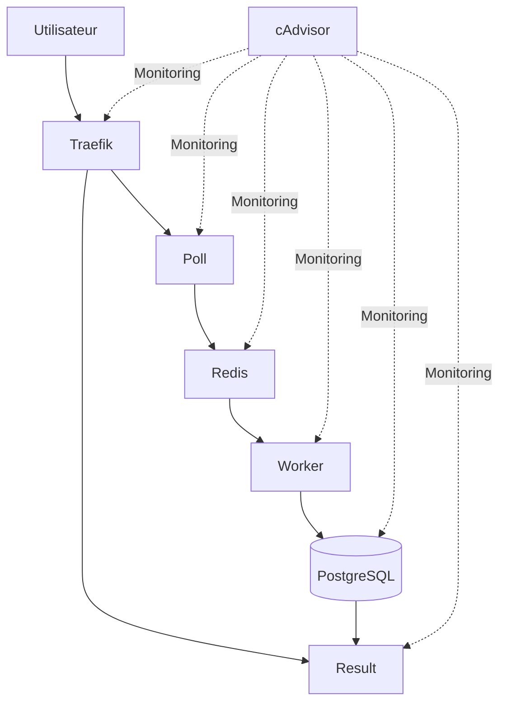

# Kubernetes Voting App

## Présentation

Ce projet déploie une application distribuée sur Kubernetes composée de plusieurs services :

* **Poll** : interface permettant de voter.
* **Redis** : stockage temporaire des votes.
* **Worker** : traitement des votes et transfert vers la base de données.
* **PostgreSQL** : stockage persistant des résultats.
* **Result** : interface d'affichage des résultats.
* **Traefik** : Ingress Controller permettant d'exposer les applications.
* **cAdvisor** : collecte des métriques des conteneurs et des nœuds Kubernetes.

---

## Architecture



---

## Structure du projet

```text
T-DOP-603-MAR_5/
│
├── cadvisor/
│   └── daemonset.yaml
│
├── poll/
│   ├── deployment.yaml
│   ├── ingress.yaml
│   └── service.yaml
│
├── postgres/
│   ├── configMap.yaml
│   ├── deployment.yaml
│   ├── pv.yaml
│   ├── pvc.yaml
│   └── service.yaml
│
├── redis/
│   ├── configMap.yaml
│   ├── deployment.yaml
│   └── service.yaml
│
├── result/
│   ├── deployment.yaml
│   ├── ingress.yaml
│   └── service.yaml
│
├── traefik/
│   ├── deployment.yaml
│   ├── rbac.yaml
│   └── service.yaml
│
└── worker/
    └── deployment.yaml
```


---

## Prérequis

Avant de déployer l'application, installer :

* Docker
* Kubernetes
* kubectl
* Minikube

Vérifier les versions :

```bash
docker --version
kubectl version --client
minikube version
```

---

## Déploiement

### 1. Démarrer le cluster Minikube

Créer un cluster Kubernetes composé de 3 nœuds :

```bash
minikube start --driver=docker -n=3
```

---

### 2. Créer le Secret PostgreSQL

Créer les identifiants utilisés par PostgreSQL :

```bash
kubectl create secret generic postgres-secret --from-literal=POSTGRES_USER=utilisateur --from-literal=POSTGRES_PASSWORD=motdepasse
```

Vérifier :

```bash
kubectl get secrets
```

---

### 3. Déployer l'ensemble des ressources Kubernetes

Depuis la racine du projet :

```bash
kubectl apply -R -f .
```

Cette commande applique récursivement tous les manifestes Kubernetes présents dans les sous-répertoires du projet.

---

### 4. Activer le tunnel Minikube

Permet d'émuler un LoadBalancer localement :

```bash
minikube tunnel
```

Cette commande doit rester active dans un terminal dédié.

---

## Vérifications

### Vérifier les Pods

```bash
kubectl get pods
```

### Vérifier les Services

```bash
kubectl get svc
```

### Vérifier les Deployments

```bash
kubectl get deployments
```

### Vérifier les StatefulSets

```bash
kubectl get statefulsets
```
---

## Accès aux applications

Une fois Traefik opérationnel :

* Poll : http://poll.dop.io:30021/
* Result : http://result.dop.io:30021/
* Traefik : http://localhost:30042/

Si nécessaire, ajouter les entrées correspondantes dans le fichier hosts :

```text
127.0.0.1 poll.dop.io
127.0.0.1 result.dop.io
```
